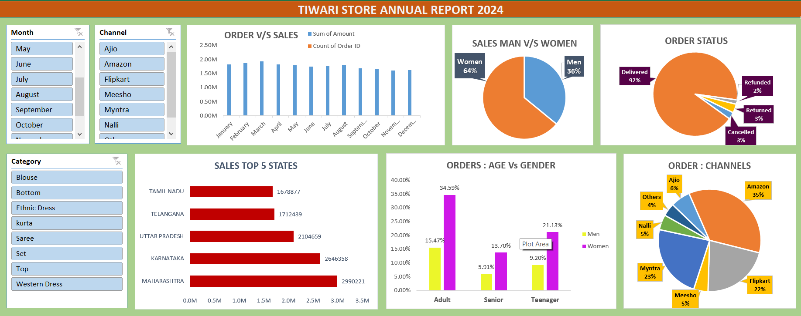

# TIWARI_STORE_SALES_ANALYSIS
A comprehensive Excel-based analysis of store sales performance, identifying sales trends, regional performance, and product-wise contributions. This project includes visual insights and data summaries to support strategic retail decisions.

---

## 📌 Problem Statement

The store has accumulated extensive sales data, but it's underutilized due to the lack of structured analysis and reporting. The goal of this project is to:
- Understand which regions, months, and products drive the most revenue.
- Highlight sales trends and anomalies.
- Present findings in a clean, visual dashboard format using Excel.

---

## 📊 Dashboard Preview

> The Excel dashboard provides a high-level overview of key metrics like total revenue, region-wise performance, product contribution, and monthly trends — making it easy to identify growth areas and bottlenecks.

---
 
## 📂 Project Structure

TIWARI_STORE_SALES_ANALYSIS/
│
├── STORE_SALES.xlsx # See the below Dataset Discription
├── Tiwari_store_dashboard.png # Dashboard screenshot image
├── README.md # Project documentation (this file)

## 🗂️ Dataset Description

The project uses a multi-sheet Excel file `STORE ANALYSIS.xlsx` with the following components:

| Sheet Name              | Description                                                                 |
|-------------------------|-----------------------------------------------------------------------------|
| `SALESvsORDER`          | Monthly order count vs. total sales amount                                  |
| `MEN_WOMEN_SALES`       | Gender-wise contribution to total sales                                     |
| `ORDER_STATUS`          | Distribution of delivered, cancelled, returned, and refunded orders         |
| `TOP_SALES_STATES`      | Revenue generated by top-performing Indian states                           |
| `SALE_BY_AGE_AND_GENDER`| Gender split across age groups (Adult, Teenager, Senior)                    |
| `CHANNELS_ORDER_MARGIN` | Order volume split across channels (Amazon, Flipkart, Myntra, etc.)         |
| `STORE`                 | Full transactional dataset with product, customer, region, and channel data |

---

## 🔍 Key Insights

- 👩 **Women contribute 64%** of overall sales – they are the top revenue drivers.
- 🏙️ **Top-performing states**: Maharashtra, Karnataka, and Uttar Pradesh.
- 🚚 **92% delivery success rate** with only 8% orders being cancelled, returned, or refunded.
- 🛒 **Sales Channels**:
  - Amazon: 35%
  - Flipkart: 22%
  - Myntra: 23%
  - Ajio, Meesho, Nalli & others: remaining 20%
- 🧑‍🤝‍🧑 **Customer Age Groups**:
  - Adult women lead purchases (34.6%)
  - Teenagers and seniors follow.

---

## 🛠️ Tools Used

- **Microsoft Excel**: Data cleaning, PivotTables, Dashboard creation
- **Charts & Slicers**: for dynamic filtering and storytelling

---

## 📤 How to Use

1. Clone or download the repo.
2. Open `STORE_SALES.xlsx` in Excel.
3. Navigate to the **Dashboard** sheet to explore key metrics.
4. Modify the slicers and filters to explore different segments of the data.

---

## 🤝 Let's Connect!

Created with 💙 by [Tiwari Shivansh](https://github.com/Tiwarishivansh07)

Feel free to ⭐️ the repo or suggest improvements via pull requests!
